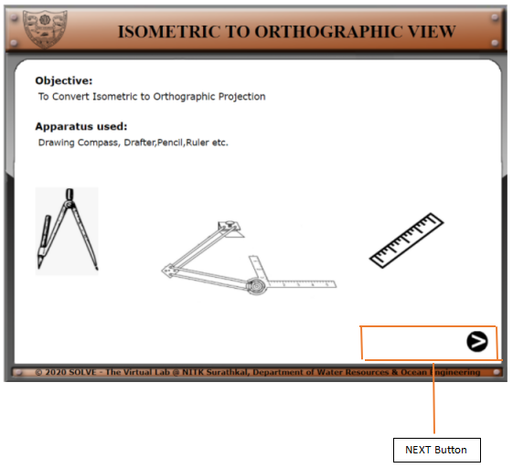
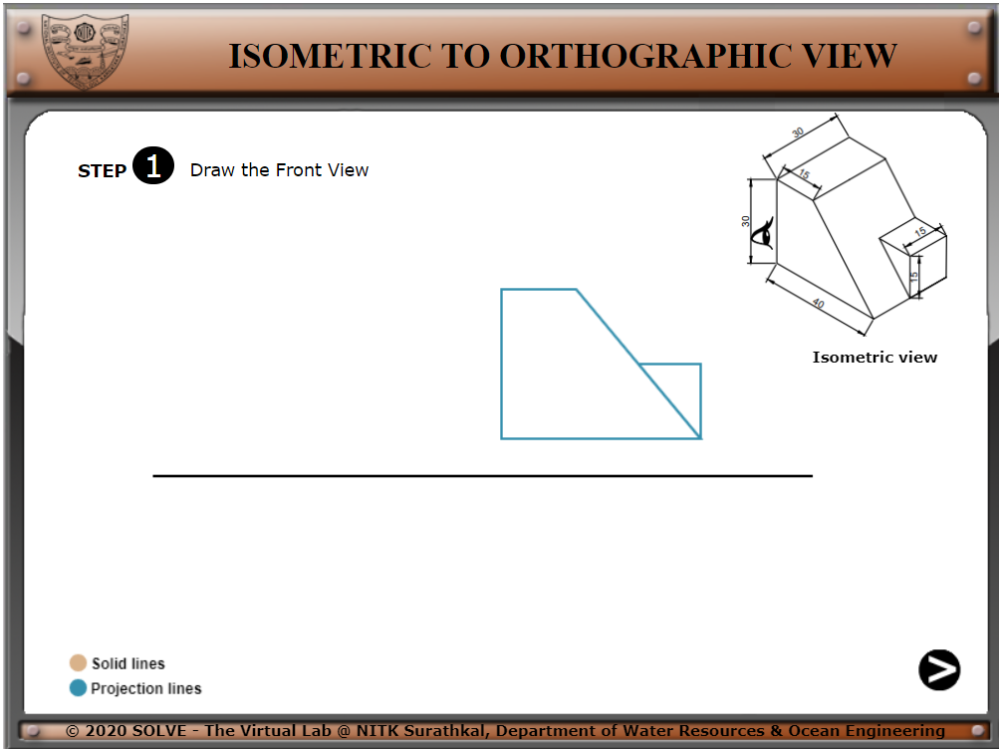
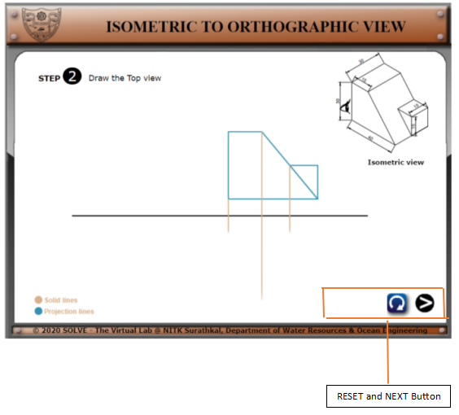
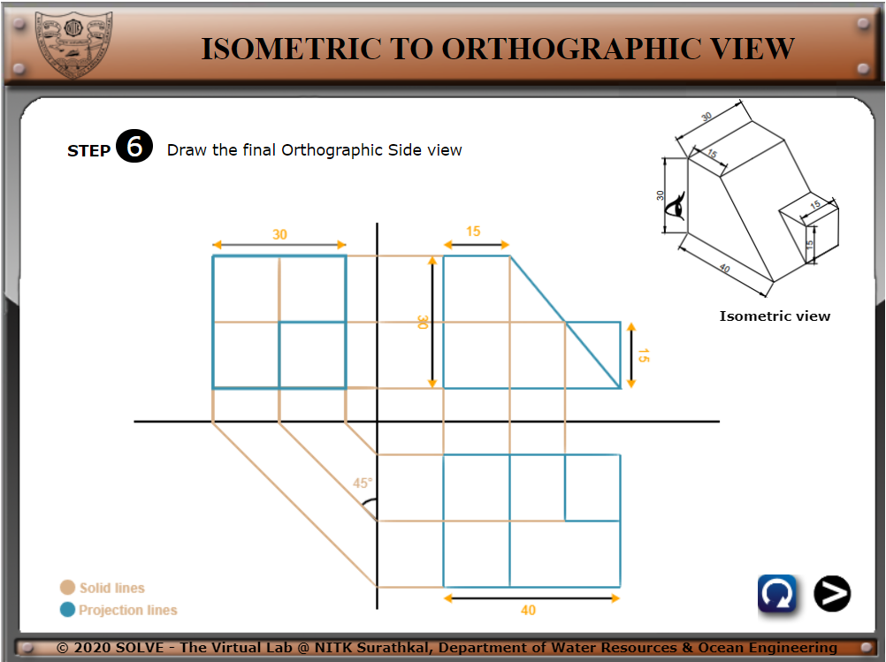

1)  **.** Click on **“Isometric projection”** the following window will
    open. Click on the **NEXT** button to proceed.

2)  **By Pressing the Button NEXT you can proceed to the next step of
    construction.  
    By pressing the NEXT button again, We proceed to Step 2.**

3)  **. Here similarly by pressing the Next button we proceed to step.
    In the right-hand corner, a Reset button**
     **gets active here.**

**4). Finally, after following all the steps, we reach the final
projection.**

**5). At any step in between, if the Reset
button** **gets clicked, the whole board resets
to Step 1.**

