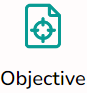
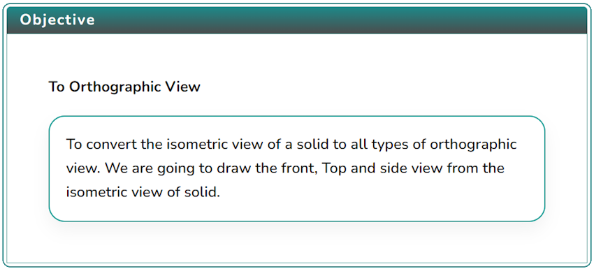
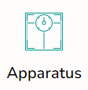

### Procedure

  Click on the Objective icon   to view the objective of the simulation. 

   
   
   Click on the Apparatus icon   to check the tools required for this simulation.

   

  Click on the Solution icon  to proceed with further simulation steps.

  

   Evaluate and choose the correct answer to proceed with further steps, click on the Next button 

  After performing the experiment, click on the Reset button  to restart the experiment.

