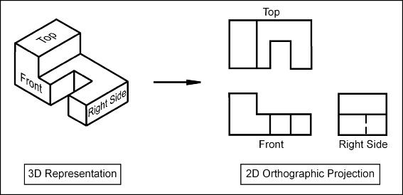

**THEORY:**

**Isometric projections** is a type of technical drawing where the three axes, i.e., x, y and z, are represented at equal angles (120 degrees) to each other. This gives a three-dimensional view where an object's depth, width and height appear to be in equal proportions.
 

When the projectors (ex: line of sight of humans) from the source are parallel to each other and perpendicular to the plane of the object, for example a person looking at building, then the projection is called as an **Orthographic Projection**.

Orthographic projection is a technique used to draw 3D objects on a 2D surface, as shown in Fig. 1. It involves using parallel projection lines that are perpendicular to the drawing surface. This method ensures that every part of the object is depicted in its true shape and size without any perspective distortion. In contrast, oblique projection uses projection lines that are not perpendicular to the drawing surface, leading to a distorted view of the object.

Fig. 1. Conversion of isometric view to orthographic representation.

